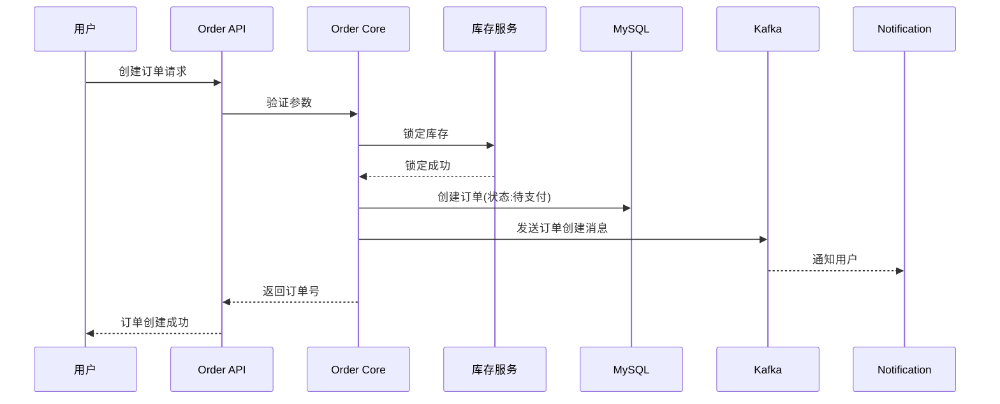

# 系统名称：电商平台订单系统

## 一、背景

随着业务快速增长，现有单体架构的订单模块已无法支撑日均50万订单的处理需求。需重构为独立微服务，支撑高并发场景下的订单创建、支付、履约全流程。

## 二、目标

1. 支撑日均50万订单，峰值QPS达到5000
2. 订单创建响应时间控制在200ms以内
3. 支付成功率保持在99.5%以上
4. 与现有商品服务、用户服务、库存服务解耦

## 三、非功能需求

### 3.1 性能需求
- 高并发场景下系统稳定运行
- 数据库读写分离，减轻主库压力

### 3.2 可用性需求
- 系统可用性达到99.9%
- 具备故障恢复能力

### 3.3 安全需求
- 用户敏感信息加密存储
- API接口需要鉴权

## 四、架构设计

### 4.1 系统架构图

```
┌─────────────────────────────────────────────────────────────┐
│                        客户端层                              │
│   ┌──────────┐  ┌──────────┐  ┌──────────┐                  │
│   │  App端   │  │  Web端   │  │  小程序  │                  │
│   └──────────┘  └──────────┘  └──────────┘                  │
└─────────────────────────────────────────────────────────────┘
                              │
                              ▼
┌─────────────────────────────────────────────────────────────┐
│                       API Gateway                            │
│            (Nginx + Lua, 负载均衡 + 限流)                    │
└─────────────────────────────────────────────────────────────┘
                              │
                              ▼
┌─────────────────────────────────────────────────────────────┐
│                      Order Service                           │
│  ┌──────────────┐  ┌──────────────┐  ┌──────────────┐       │
│  │ Order API    │  │ Order Core   │  │ Order Worker │       │
│  │ (REST接口)   │  │ (业务逻辑)   │  │ (异步处理)   │       │
│  └──────────────┘  └──────────────┘  └──────────────┘       │
└─────────────────────────────────────────────────────────────┘
         │              │              │
         ▼              ▼              ▼
┌────────────┐   ┌────────────┐   ┌────────────┐
│ MySQL主库  │   │   Redis    │   │   Kafka    │
│ (订单数据) │   │ (缓存/锁)  │   │ (消息队列) │
└────────────┘   └────────────┘   └────────────┘
         │
         ▼
┌────────────┐
│ MySQL从库  │
│ (读查询)   │
└────────────┘
```

### 4.2 服务依赖关系

| 依赖服务 | 调用方式 | 用途 |
|---------|---------|------|
| 商品服务 | HTTP REST | 查询商品信息、价格 |
| 用户服务 | HTTP REST | 查询用户信息、地址 |
| 库存服务 | HTTP REST | 锁定/释放库存 |
| 支付服务 | HTTP REST | 发起支付、查询支付状态 |
| 通知服务 | Kafka消息 | 发送订单状态变更通知 |

### 4.3 部署架构

单机房部署，Order Service部署2个实例，通过Nginx做负载均衡。

## 五、核心流程设计

### 5.1 订单创建流程



### 5.2 订单支付流程

用户发起支付 → 调用支付服务 → 支付成功回调 → 更新订单状态 → 发送履约消息 → 通知用户

### 5.3 订单取消流程

用户取消订单 → 检查订单状态 → 调用库存服务释放库存 → 更新订单状态 → 发送取消通知

## 六、API定义

### 6.1 创建订单

**接口路径**: `POST /api/v1/orders`

**请求参数**:
```json
{
  "user_id": 10001,
  "items": [
    {
      "product_id": 20001,
      "sku_id": 30001,
      "quantity": 2,
      "price": 99.00
    }
  ],
  "address_id": 50001,
  "coupon_code": "SAVE10"
}
```

**响应结果**:
```json
{
  "code": 0,
  "message": "success",
  "data": {
    "order_id": "ORD202401150001",
    "total_amount": 198.00,
    "pay_amount": 188.00,
    "status": "pending_payment",
    "expire_time": "2024-01-15T12:00:00Z"
  }
}
```

### 6.2 查询订单

**接口路径**: `GET /api/v1/orders/{order_id}`

**请求参数**: 无

**响应结果**:
```json
{
  "code": 0,
  "message": "success",
  "data": {
    "order_id": "ORD202401150001",
    "user_id": 10001,
    "status": "paid",
    "total_amount": 198.00,
    "items": [
      {
        "product_id": 20001,
        "product_name": "测试商品",
        "quantity": 2,
        "price": 99.00
      }
    ],
    "address": {
      "province": "广东省",
      "city": "深圳市",
      "district": "南山区",
      "detail": "科技园路1号"
    },
    "create_time": "2024-01-15T10:00:00Z",
    "pay_time": "2024-01-15T10:05:00Z"
  }
}
```

### 6.3 取消订单

**接口路径**: `POST /api/v1/orders/{order_id}/cancel`

**请求参数**:
```json
{
  "reason": "不想买了"
}
```

**响应结果**:
```json
{
  "code": 0,
  "message": "订单已取消"
}
```

## 七、数据模型设计

### 7.1 订单主表 (orders)

| 字段名 | 类型 | 说明 | 备注 |
|-------|------|------|------|
| id | BIGINT | 主键 | 自增 |
| order_no | VARCHAR(32) | 订单号 | 唯一索引 |
| user_id | BIGINT | 用户ID | |
| status | TINYINT | 订单状态 | 0:待支付,1:已支付,2:履约中,3:已完成,4:已取消 |
| total_amount | DECIMAL(10,2) | 订单总额 | |
| pay_amount | DECIMAL(10,2) | 实付金额 | |
| address_id | BIGINT | 地址ID | |
| create_time | DATETIME | 创建时间 | |
| update_time | DATETIME | 更新时间 | |

### 7.2 订单明细表 (order_items)

| 字段名 | 类型 | 说明 | 备注 |
|-------|------|------|------|
| id | BIGINT | 主键 | 自增 |
| order_id | BIGINT | 订单ID | 外键 |
| product_id | BIGINT | 商品ID | |
| sku_id | BIGINT | SKU ID | |
| quantity | INT | 数量 | |
| price | DECIMAL(10,2) | 单价 | |
| product_name | VARCHAR(100) | 商品名称 | |

### 7.3 订单状态变更日志表 (order_logs)

| 字段名 | 类型 | 说明 |
|-------|------|------|
| id | BIGINT | 主键 |
| order_id | BIGINT | 订单ID |
| old_status | TINYINT | 原状态 |
| new_status | TINYINT | 新状态 |
| operator | VARCHAR(50) | 操作人 |
| operate_time | DATETIME | 操作时间 |

## 八、缓存设计

### 8.1 Redis缓存策略

| Key格式 | 数据类型 | TTL | 用途 |
|--------|---------|-----|------|
| `order:{order_id}` | String(JSON) | 30分钟 | 订单详情缓存 |
| `user_orders:{user_id}` | List | 1小时 | 用户订单列表 |
| `order_lock:{order_id}` | String | 5分钟 | 订单操作分布式锁 |

## 九、消息队列设计

### 9.1 Kafka Topic定义

| Topic名称 | 分区数 | 用途 |
|----------|-------|------|
| `order_created` | 8 | 订单创建事件 |
| `order_paid` | 8 | 订单支付成功事件 |
| `order_cancelled` | 4 | 订单取消事件 |
| `order_timeout` | 4 | 订单超时未支付事件 |

## 十、异常处理设计

### 10.1 异常场景处理

| 异常场景 | 处理方式 |
|---------|---------|
| 库存不足 | 返回错误码，提示用户 |
| 支付失败 | 更新订单状态，通知用户 |
| 网络超时 | 重试机制，最多重试3次 |
| 数据库异常 | 记录日志，返回系统错误 |

## 十一、监控指标

- 订单创建成功率
- 订单支付成功率
- 平均响应时间
- 系统错误率

---

## 附录：已知问题清单（供检视演示）

**注意**：此文档故意包含以下问题，用于演示Agent检视能力：

1. ❌ 非功能需求缺少具体指标数值（如QPS、响应时间）
2. ❌ 部署架构存在单点故障（单机房、仅2实例）
3. ❌ 缺少Redis不可用时的降级方案
4. ❌ API响应字段与数据模型定义不完全一致（响应中有product_name，表定义中也有）
5. ❌ 外部服务调用未说明超时和重试配置
6. ❌ 缺少API版本演进策略
7. ❌ 并发场景下的库存锁定竞态条件未说明
8. ❌ 订单超时未支付的自动取消机制未说明
9. ❌ 缺少限流和防刷策略
10. ❌ 监控指标未给出具体阈值